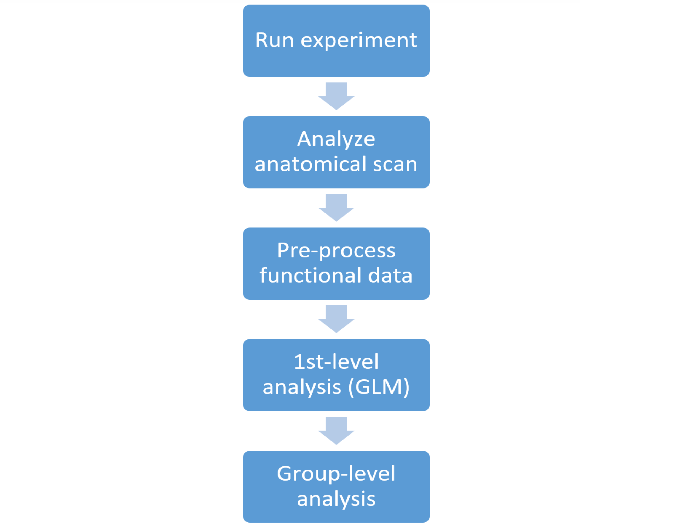

This guide is about running basic fMRI analysis using FreeSurfer, FSFast, and Matlab, including anatomical processing, functional data preprocessing, first-level GLM analysis, and importing all relevant data into Matlab for subsequent analysis. See the [accompanied guide on how to plan and run an fMRI experiment](/plan_and_run_fmri_exp/). Note that this guide does not deal with group-level analysis or any advanced methods. Using the accompanied code requires at least a basic knowledge of Matlab.

The guide is accompanied by several supporting files:
* 

## Why I chose FreeSurfer/FSFast over SPM/Brain Voyager/fsl
This was mentioned in the previous guide but it's worth repeating here:

1. I think surface registration is a _must_ for good group-level analysis of cortical activity. It also makes it possible to match subjects’ brains with external atlases which are formatted as template cortical surfaces.
2. While the integration of FS with Matlab is not as easy as with SPM (which is already on Matlab), it is still simple enough (you can use my functions for importing data from FS into Matlab, displaying 3D brains, etc.).
3. FS and FSFAST are pretty simple to implement (they do however seem to be a bit more “black-box” than the other open-source options, in the sense that looking at the results of intermediate stages of analysis is not always straightforward).

## General outline and keeping your data organized
The starting point for this pipeline is the anatomical and functional scans from your experiment (for a single subject). The pipeline will run FreeSurfer to produce anatomical surfaces and metadata, then run FSFAST to preprocess the functional data and map it to the cortical maps (so that instead of functional volume data, e.g. time course per voxel, you get surface data with time course for each node in the surface mesh). You can use FSFAST to run a first-level analysis to remove nuisance variables and compute condition beta values, run contrasts between conditions, etc.. Second-level analysis (i.e. group-level statistics) is also possible but not covered here (because I didn't use it). Learning about using FreeSurfer and FSFAST is most easily accomplished through the recorded lectures on [FreeSurfer's YouTube channel](https://www.youtube.com/channel/UCruQerP8aa-gYttXkAcyveA) (in particular see "Introduction to FreeSurfer" and "FSFAST"). Understanding the analysis script will be easier after watching the lectures.

The pipeline makes use of the following tools:
* **FreeSurfer**: an open-source software tool for processing and analyzing brain MRI images. It takes an anatomical T1 brain scan as input and applies to it many stages of anatomical processing: skull stripping, segmentation of sub-cortical structures, reconstruction of the cortical surface, segmentation and labeling of the cortical surface through registration to a template brain, extraction of metadata such as cortical thickness and curvature, and more. Using FreeSurfer's cortical surfaces is recommended because individual brains' variability in cortical folding patterns means that comparing brains using simple volume registration will lead to very different functional areas being registered as parallel locations. Surface registration takes folding patterns into account resulting in a much better fit between subjects. Additionally, many published cortical atlases come in the format of a surface cortical template which can be registered to individual surfaces. FreeSurfer runs on Linux only (and therefore requires a virtual machine if you're using Windows) and about 12-24 hours for each subject.
* **FSFAST**: FreeSurfer's functional analysis tool. It is recommended if you are using FreeSurfer because they are naturally well-integrated. Combining other analysis tools with their own advantages is of course possible but you'll have to make that work on your own.
* **Matlab**: provides the basic framework throughout this analysis pipeline. Each step of the analysis, including running external software (like FreeSurfer), is implemented from within the Matlab script.

### How to organize your analysis folders
My recommendation for the directory structure of the analysis folder is as follows:
* Anatomical: will hold the anatomical information (after conversion to the Matlab format by the analysis script) and clean brain images produced by FreeSurfer.  
* FreeSurfer/FSFAST: will hold the analysis scripts and results of the initial FSFAST analysis. Note that FreeSurfer's anatomical subject data is expected to be on the ~/FreeSurfer/Subjects folders on the Linux machine on which FreeSurfer runs.
* Main: will hold the experiment-specific scripts and results.

Note that the _run_fsfast.m_ analysis script assumes that the results folder has a subfolder named as each subject’s ID (e.g. “s101” etc.), and will also create such a subfolder within the anatomical and fsfast folders.

## fMRI analysis workflow
The general steps involved in this fMRI analysis pipeline are summarized in the following chart:

* Analyzing the anatomical data involves taking the T1 anatomical scan and feeding it to the FreeSurfer algorithm. This will result in both “cleaned” T1 volume images and cortical surface objects. The latter are imported into Matlab along with any metadata provided by FreeSurfer such as cortical thickness (and additional metadata e.g. from external anatomical atlases).
* Pre-processing of the functional data includes (optionally) motion correction, slice timing correction, spatial smoothing, intensity normalization, and brain-mask creation.
* 1st-level analysis is the application of a GLM to the functional data for two purposes: 1. Regressing out “nuisance factors” (including head motion and polynomial predictors of each block, e.g. baseline level, linear trend, parabolic trend etc.); 2. Computing beta levels for your experimental factors for the analyzed subject. This step also includes planned contrasts between experimental conditions within each subject.
* Group level (or 2nd-level) analysis is the statistical analysis of your results (e.g. the subjects’ beta values or contrast t-values) across your subject sample.

In working with this analysis pipeline and the provided scripts, you have three main options:
1. Use the FSFast functionality up to and including first level analysis. This means that the final output will be cortical surface maps of beta-values (or t-values for contrasts) which you will read into Matlab (use the matlab function **XXX**) and apply group-level analysis or any other type of analysis yourself.
2. Use the FSFast functionality for the group-level analysis as well. This is not implemented in the scripts – you will just need to learn about the relevant commands from the documentation or recorded lectures and add them yourself.
3. Use the FSFast functionality only up to the pre-processing step. This may be the case if you want to run the subject-level GLM yourself (if it is non-standard, or if you don’t want to use FSFast’s format for specifying the regression model). The **XXX** script will do this… XXX

Another choice you will need to make is whether to use a common template cortical map for all your subjects or keep each subject’s individual anatomical brain morphology. The first option means that FreeSurfer’s surface registration (already applied to each subject in order to parcellate their cortical areas) will be used to map each subject’s functional data to a single common cortical template (the “fsaverage” template). This should be your choice if you plan to run group-level analysis on a voxel-level, since you will have a single cortical surface with all subjects’ functional data time course mapped to each node. This will allow you for example to produce a cortical map of group-level effect size. The second option is to analyze each subject’s functional data in relation to their own cortical surface. This avoids any co-registration errors because there is no need to map one brain to another. A common application of this approach is region-of-interest-based analysis – for each subject define anatomical or functional ROIs (e.g. V1, FFA), and run group-level analysis of measurements extracted from those, thus avoiding the need to compare single voxels directly. This approach is useful for functional ROI based analysis since functionally-defined areas may not necessarily align anatomically across subjects on the common template.

In the context of the _run_fsfast_ script, this choice will be reflected in how you configure your analysis in the “Create analysis configuration” code section (see below).

## Using the _run_fsfast_ script
The script (available [here](...)) encapsulates the entire analysis pipeline after the anatomical and functional MRI images are downloaded from the scanner and placed in the experiment results folder. The script includes all analysis steps from anatomical scan processing up to 1st level analysis.

Since FreeSurfer is not a Matlab library but is meant to be run from a Linux shell, whenever the script calls a FreeSurfer command it uses the system function, which outputs a string to the operating system. And so for example the Matlab command system('freeview') on a linux OS will run the freeview command as if it was run from the shell command line.

The script is divided into code sections (signified by “%%” in Matlab), which can be run separately (press Ctrl-Enter or the “Run Section” button). It is also possible to run the entire script at once without stopping, or call it from another script (for example within a loop that calls it for each subject).

An overview of the code sections is as follows:
* **Set global parameters**: Define constants that are the same for all subjects, like the basic directory structure and software libraries paths.
* **Set subject parameters**: Define subject-specific parameters. Subjects are defined with a subject ID. If a subject ID is not provided (e.g. from another script calling this one), you will be prompted to provide it.
*	**Create subject folders and subjectname file and convert T1 DICOM to nifty**: This section will: 1. Create the folder structure for the new subject within the anatomy and fsfast analysis folders; 2. Create a subjectname file, a simple text file used by the FreeSurfer software; Convert the anatomical T1 scan from DICOM to nifty format (using the MRIcron software).
* **Run FreeSurfer on the anatomical scan**: This will run the main FreeSurfer analysis procedure on the T1 nifty file. _This can take up to 24 hours_.
* **Inspect the results using freeview**: Freeview is a visualization utility used to display the results of the FreeSurfer anatomical analysis. You should expect to see the cortical volume image, surrounded by a yellow outline indicating the borders of the detected cortical surface. If the outline does not surround the cortical surface, FreeSurfer may have run into problems (this is usually due to low image quality or severe abnormalities in the brain). In this case you may have to go back and manually edit the T1 image to guide FreeSurfer in finding the cortical surface (consult the relevant lectures).
* **Unpack functional files into FsFast directory structure**: This code section will read the functional DICOM images into FsFast’s custom directory structure within the fsfast analysis folder. The code first maps the DICOM files found within the subject’s results folder (for some reason, this can take more than an hour), and then imports the data. You need to define exactly which analysis blocks should be included in each analysis stream – and this can be different for each subject. For example, if the first block was an anatomical localizer, the second was a practice block, the third was aborted due to a crash in the experiment for this particular subject, 4-11 were the main experimental session, and 12-14 were a separate region-of-interest localizer experiment – you would need to specify how blocks 4-14 should be mapped into the two analyses for this subject.
* **Import FreeSurfer-generated images and convert to nifti, produce stripped cortex volume images**: FreeSurfer applies several image-processing steps to the raw T1 anatomical scan, including volume and intensity normalization, skull-stripping, etc. This section imports these images from the FreeSurfer subjects folder to the anatomy folder, after converting them to nifty format. The imported images include
  1. A volume-normalized scan (original image normalized to a standard 256x256x256 space)
  2. An intensity-normalized scan (where all voxels of the same tissue type have the same intensity value)
  3. Separate images for the whole cortex and the left and right hemispheres after segmenting out the skull and subcortical structures (done by importing a cortical mask image and applying it to the whole-brain image).
* **Read pial and inflated cortical surfaces from FreeSurfer format to Matlab**: FreeSurfer stores the left and right cortical surfaces in its own format, which is read into Matlab here as a “mesh” object using the read_surf function from FreeSurfer’s Matlab functions library. Two types of surface are imported – a pial surface representing the original shape of the cortical surface, and an inflated surface where the hemisphere is “inflated” such that sulci and gyri are eliminated (useful for visualization since no voxels are hidden within sulci; this code could in principle be expanded to also produce a flattened cortical surface). Importantly, this step also transforms the coordinate system from FreeSurfer’s specific surface coordinate system to a standard RAS (Right-Anterior-Superior) system. Along with the cortical mesh objects, metadata is also imported including parcellation into cortical areas, thickness and curvature of each surface node. All the information is saved within one Matlab data structure brain_data. The cortical surfaces can be visualized (along with any surface-mapped meta-data) using the [ECoG/fMRI Visualization Toolbox](/vis_toolbox/).
* **Add retinotopic maps from external V1/V2/V3 atlas**: FreeSurfer’s parcellation scheme provides anatomical labels but not functional ones. The anatomically-based atlas of areas V1-3 by Benson et al.1,2 is an alternative to running individual retinotopy scans on your subjects. It is based on FreeSurfer’s surface registration of the individual brain to a standard anatomical template, and the authors report that the method’s accuracy is similar to that of actual retinotopical measurement. The code section will add the visual area labels as another metadata layer to the brain_data Matlab data structure. You will need to have specified the path to the atlas data in the global parameters section. The relevant files can be found [here] (in R:\CommonResources\Tools\Anatomical Maps\Benson\Atlas).
* An additional external Atlas that can be used is the probabilistic atlas described in: Wang, L., Mruczek, R., Arcaro, M., & Kastner, S. (2014). Probabilistic Maps of Visual Topography in Human Cortex. Cerebral Cortex, 1–21. However, this atlas was published as a SUMA-format surface, which was not implemented in this pipeline. Read about SUMA below to see what this means.
* **Run pre-processing pipeline**: This code section simply runs the FSFast’s preprocessing command _preproc-sess_. This procedure applies (optionally) motion correction, slice timing correction, smoothing, intensity normalization, and brain-mask creation. Some of the steps are not run by default – see the command documentation online. If you have more than one analysis stream (e.g. localizer experiment and main experiment) you will need to run this command for each one. Each preprocessing step in FSFast produces a separate nifty-format data file, named as a concatenated string of labels indicating the applied processing steps. So for example fmcpr.down.sm4.my_subject.rh refers to right-hemisphere data from my_subject after motion correction, slice timing correction (with "down" slice order), and 4 mm smoothing.
* **Create paradigm files**: This step is required if you want to apply FSFast’s first level GLM analysis to your experimental factors, and defines the regression model for these factors (i.e. which experimental conditions are active at each TR during the experiment). This is done by writing a text file that is saved in each scanning block’s folder. The script includes an example of how this is done for a visual category localizer scan.
* **Create analysis configuration**: This runs the command that configures the 1st level analysis. Among other things, you need to decide whether your functional data will be mapped to the subject’s individual cortical surface or to another surface (e.g. the common fsaverage template). Read the mkanalysis-sess documentation for a full list of options. If you are using the same cortical surface for all your subjects, you don’t need to run this code section more than once.
* **Create contrasts for 1st level analysis**: If you are running 1st-level GLM analysis on your experimental conditions and want to also apply contrasts between those conditions, this is where you define them. The code includes an example of how this is done for the visual category localizer experiment. You don’t need to run this code section more than once. Run first level analysis: Runs the 1st-level analysis. Consult the documentation for the selxavg3-sess command for full list of options. If you want to also keep the residual of the GLM and not just the beta and t-values (for example, if you are running the GLM just to remove nuisance factors), specify this here. The beta values resulting from this analysis will be saved as a compressed nifty file within the analysis folder (e.g. _Analysis/FreeSurfer/my_subject/vis_category_localizer/vis_category_localizer.rh/betas.nii.gz_). The results of any planned contrasts (t-values, p-values, etc.) will be similarly stored in a subfolder bearing the contrast’s name. Read these files using FreeSurfer’s matlab function MRIread after unzipping them.
* **Extract zipped data files**: This is not part of the FSFast functionality, but any functional data files you plan to read into Matlab (e.g. beta values or processed time series data) should be unzipped first so they can be read more quickly into Matlab. The function _read_gzip_nifti.m_ available with the pipeline scripts will unzip the files before reading them if they are compressed, but it is more convenient to unzip them in advance using the Linux gunzip command.

1 Benson, N. C., Butt, O. H., Datta, R., Radoeva, P. D., Brainard, D. H., & Aguirre, G. K. (2012). The retinotopic organization of striate cortex is well predicted by surface topology. Current Biology, 22(21), 2081–2085.

2 Benson, N. C., Butt, O. H., Brainard, D. H., & Aguirre, G. K. (2014). Correction of Distortion in Flattened Representations of the Cortical Surface Allows Prediction of V1-V3 Functional Organization from Anatomy. PLoS Computational Biology, 10(3).

## Using the _import_fsfast_results_ script
This script contains several code sections that will be useful for working with the results of running the run_fsfast script. This script does not use FreeSurfer commands (only Matlab functions from the FreeSurfer library), and so can be run on any operating system.

An overview of the code sections is as follows:
* **Set subject parameters**: Define where the subject data is stored.
* **Load and visualize anatomical data**: This code section demonstrates how to use the brain_data structure generated using the run_fsfast script, to plot 3D cortical surfaces as well as color them according to voxel-mapped metadata. This is done using functions from the [ECoG/fMRI Visualization Toolbox](/vis_toolbox/)
* **Read functional data - after preprocessing and before 1st level GLM**: This code section demonstrates how to read functional data produces by FSFast, after the preprocessing stage and before any 1st level analysis.
* **Read functional data - residuals after 1st level GLM**: This code section is similar to the previous one but is designed to read the residual data after all variance explained by the GLM model was removed.
* **Read 1st level GLM results**: This code section demonstrates how to read 1st level GLM results (e.g. beta values, contrast t-values etc.).
* **Read head movement data**: Run this code to read the estimated head movements during the experiment (roll, pitch, yaw, and displacement on the x/y/z axis).
* **Import 1st level GLM regressor structure**: If you ran a 1st level GLM analysis, you can use this code section to read into Matlab the full model generated for this analysis (i.e. the time course of each regressor).

## Appendix: Setting up a Linux machine with the necessary software
This is a guide to installing a virtual machine (VM) on Windows that will run the Linux operating system. The virtual machine part is detailed simply because that was required for me as we used Windows machines in our lab and a dedicated separate machine was too inconvenient. If you have a linux machine you can ignore the parts about setting up the virtual environment.

### Virtual machine setup
1. Install a VM virtualization software. I used the Oracle VM VirtualBox: https://www.virtualbox.org/wiki/Downloads. The instructions here will refer to this software.
2. Select or download a Linux distribution. I used the CentOS distribution (http://www.centos.org/download) because it was the only one on which I managed to install the BioImage Suite software (not part of this pipeline; used for marking intracranial electrode locations on a 3D brain as part of my ECoG pipeline).
3. Create the VM:
  * In Virtual Box, create a new Linux virtual machine:
  * Give it a name, and select "Linux" and "Other Linux" (assuming you're using a distribution you downloaded; 32 or 64 bit depending on your system).
  * Give it at least 1024MB RAM (I gave it 4MB out of my available 8GB).
  * Create a virtual hard drive (VDI) - you need to give it enough memory space for all the necessary software packages (it is complicated to add additional space once the machine is created) and data. This includes more or less 20GB for software (counted as everything but the /home directory on my machine), plus the size of all shared folders, plus the FreeSurfer subjects folder, which takes up about 1.3GB for every analyzed subject. Before you do this, make sure the virtual disk is stored where you can spare the space. You can set this at File->Preferences->General->Default machine folder.
    * Right-click -> settings:
    *	General- > Advanced -> set "shared clipboard" and "drag'n'drop" to "bidirectional.
    *	Display -> 64MB Video RAM (with 32MB, the brain images did not display).
    *	Display -> check Enable 3D acceleration
    *	Storage -> Under Controller: IDE, select the CD ROM icon, then click the small CD ROM icon on the right and find the downloaded ISO file.
    *	Shared Folders -> Add any needed folders (select "auto-mount" and "make permanent" - not sure if this is necessary)
  *	Start the virtual machine and begin the installation. If at any time the disk is "ejected", it can be re-inserted from the menu bar; Devices->CD/DVD Devices.
  *	You can skip the "media test".
  *	Select a root password and make sure you do not forget it. You can use "humancognitive".
  *	Select "Use All Space"
  *	Selecting an installation configuration: "Desktop" is fine. Once the installation is done, restart and finish the setup. Select a user name and password.
  *	You don't need to enable "kdump". When asked whether to reboot click "Yes".
  * Until you complete the "Install Virtual Box Guest Additions" section (see below), you will not be able to copy/paste between the host and the virtual machine, or increase the virtual machine's screen resolution.
4. Once the virtual machine is running:
  *	To enable internet access: Click the network icon in the top bar and select an available network connection (this is necessary for the upcoming updates and downloads).
  * Enable "super-user" for your user:
    Open a terminal and enter:
    su -
    <enter root password in prompt>
    echo '<user_name> ALL=(ALL) ALL' >> /etc/sudoers
    Where <user_name> is your user name
    Type 'exit' to switch out of the root user or close the terminal.
  *	Update system
    Open a terminal and type:
    Sudo yum update
    (this will take a while)
    *	Install Virtual Box Guest Additions
    Open a terminal and enter:
    sudo yum install gcc
    And:
    sudo yum groupinstall "Development Tools"
    reboot
    After booting up (remember to activate the network connection again…) -
    On the top menu, click Devices -> Insert Guest Additions CD Image, and run the installation.
    Right-click on the desktop icon for the CD Drive and select 'Eject'.
    Power off and restart the virtual machine.
    * Give access permissions to the shared folders
    Create a new folder for each shared folder where you want it to be, for example ~/shared_folders/<shared_folder_name> (~ = /home/<user>). Use either the file browser or from the terminal:
    mkdir ~/shared_folders
    mkdir ~/shared_folders/<shared_folder_name>
    Now enter in a terminal:
    sudo mount -t vboxsf -o uid=1000,gid=1000,rw <shared_folder_id> <target_drive_location>
    Where <shared_folder_id> is the name you gave the folder when you defined it in the Virtual Box program, and <target_drive_location> is the path of the folder you just created.
    You need to do this for every shared folder separately. If you don't remember the ID's you gave to the shared folders, look at Settings->Shared Folders in VirtualBox again or look at the contents of /media (but disregard the "sf_" prefix).
    You can subsequently add a shortcut to these folders from other locations, using :
    ln -s <shared folder location> <shortcut location>
    NOTE: Unfortunately this procedure is not preserved after restarting the machine (the mounting), so it's necessary to do this every time. To make this less inconvenient, my solution was to add a desktop shortcut to run this command. Here is how:
    Create a text file somewhere and give it an appropriate name, for example: ~/Documents/scripts/mount_shared_folders
    Open this file and enter the following lines:

    #!/bin/sh
    <mount command>

    Where <mount command> is the same as above (sudo mount -t … ).
    Now right-click on the desktop and select "Create Launcher". For Type select "Application in Terminal", for Name give it a name (like "mount shared folders"), and for Command enter:
    sh <path>
    Where <path> is the full path of the script you created. When you run this launcher, it will open a terminal and run the script, asking you for the root password and activating the mount.

### Required software
* **FreeSurfer**: Great tool that segments the brain and converts it to a cortical surface (which can be registered to a standard surface).
Follow download, installation, registration and configuration instructions on [http://freesurfer.net]. It takes a few steps but it's quite straightforward.
One additional step that I needed to make: by default, FreeSurfer is installed to /usr/local. This means you will need root permissions to edit the files there. This is a minor nuisance during installation, for example when you need to create the license.txt file (but getting over this difficulty is part of learning to use basic Linux, so deal with it). However it's more of a problem when you actually run FS since the Subjects folder, to which all results are written is by default under the same folder (/usr/local/freesurfer/subjects). What I did is to edit the SUBJECTS_DIR variable in /usr/local/freesurfer/SetUpFreeSurfer.sh from the default value to my home folder (in my case, to /home/hcnl/freesurfer/subjects).
Another minor point - for some reason a lot of the files produced by the freesurfer analysis are marked as hidden files - if you can't find a file try showing hidden files.
FreeSurfer citation information: https://surfer.nmr.mgh.harvard.edu/fswiki/FreeSurferMethodsCitation.
* **MRIcron**:  A small and very handy utility for displaying f/MRI/CT images. Does not have a "3D volume" display, but is useful for showing several overlaid images (for example when testing the results of white/gray matter segmentation or brain surface generation). It's also used for converting MRI images from DICOM to NIFTI format.
Download: [http://www.mccauslandcenter.sc.edu/mricro/mricron/install.html]
* **Matlab**: You will need Matlab to run the analysis scripts. Add the FreeSurfer Matlab folder to your path: it's in <FreeSurfer Home Directory>/matlab
