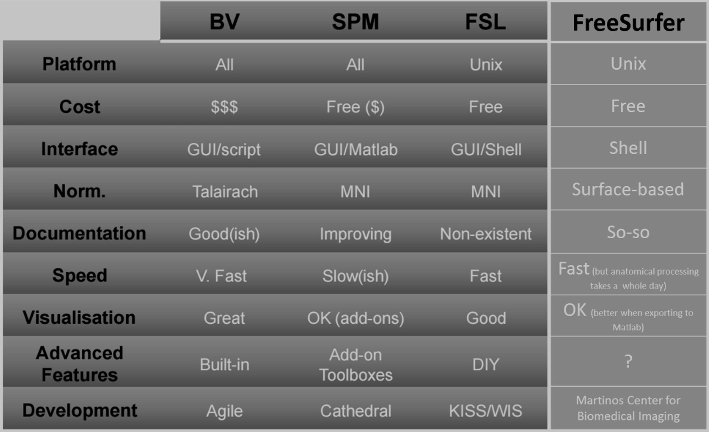

When I was running my first fMRI experiment after several EEG/iEEG experiments, I did so in a lab that did not have any established workflow or recent experience with this modality. This meant that I had to learn and get everything set up from scratch - a good opportunity to pave the way as I was going.
The following guide (and the accompanying [How to analyze fMRI data with FreeSurfer and FSFast](/analyze_fmri_data/) has been written for this purpose. I have revised this web version to be as useful as possible for anyone out there starting out with fMRI.

The guide is accompanied by several supporting files [available on GitHub](https://github.com/edden-gerber/fmri-experiment-bundle):
* **Experiment checklist example**
* **Experiment protocol example**
* **Participant briefing checklist example**
* **Code for example visual fMRI experiment (with eye-tracking)**: Written in Matlab using PsychToolBox. You can modify this code to create your own experiment or better understand how to build one. Includes the following files:
  * _visual_fMRI_exp_with_EyeLink.m_: experiment code
  * _exp_codes.mat_: example experiment trial conditions data
  * _Generate_Trial_Lists.m_: code to generate _exp_codes_
  * _instructions_eng.txt_: experiment instructions text
  * _Stimuli_ folder: stimulus images used by the experiment.  

  The experiment uses a slow event-related visual paradigm. In each 34.5 sec trial, an image of a face or a house appears for 9 or 15 seconds. The participant needs to focus on a central fixation cross present throughout the trial, and respond with a button press in rare occasions when it briefly changes shape (from "+" to "-"). Yes, this is an excruciatingly boring experiment.

## Issues to consider when designing your experiment

After working out the general design of your experiment, you will need to **determine the optimal scanning protocol and parameters for your scan**. Consult any relevant literature and preferably schedule a meeting with your MR physicist to discuss this. For optimal signal to noise ratio, you should aim to achieve the lowest TR possible under your constraints. Shortening the TR can be done by using Multi-Band acquisition, limiting the number of slices (scanning only part of the brain or increasing slice width), using a smaller field-of-view (area of each slice), etc. Also decide which anatomical scan to include in the scanning session – T1 weighted MPRAGE is usually the default. Other possibilities include DWI and qT1, which could be used to finely characterize the white matter properties and cortical thickness, respectively.

A second critical issue to consider in advance is **achieving a design with maximal statistical power**. In particular, you need to understand whether you should be optimizing your design for response detection vs estimation. Simply put, the former means using prior knowledge about the hemodynamic response to measure a single parameter (its magnitude) for each condition, and the latter means measuring the shape of the response rather than assuming it (these are points on a spectrum rather than a binary choice; for example, you could also estimate the shape of the response but assume a parametric model for it, thus reducing the number of parameters you are estimating). This optimization is reflected in the choice of stimulation paradigm (event-related, block design, etc.). Another issue, especially if you are planning to use a fast event-related design, is the optimal timing of the stimulus sequence. A commonly-used tool for this purpose is [optseq](https://surfer.nmr.mgh.harvard.edu/optseq/) (and a fairly acceptable alternative for is the genetic algorithms approach – see for example [here](http://biorxiv.org/content/early/2017/03/23/119594)). Make sure you understand this issue when planning your experiment.

It is *highly* recommended to **run a pilot version of your experiment** before starting to work on a full subject sample. Especially if you are not experienced with fMRI, the results may not always be what you expect. A good approach for a pilot is to focus on a specific part of the experiment (e.g. a minimal subset of your conditions), and on testing basic design parameters (e.g. do your stimuli elicit the expected response, are you collecting enough data per condition, are you using optimal stimulus duration, ISI etc.). A pilot is also very useful to help define the precise details of your analysis pipeline using a real test case, before starting data collection (this would also be a good time to pre-register your experiment).

Before your first scan you will of course need to **have the experiment approved by the ethics committee**. This takes time so initiate this procedure as soon as possible. Your PI should be the best authority on this matter, but a general guide is to make the application as broad as possible so you are not constrained by it when you make changes. Two aspects of the ethics approval that may not necessarily be enforced but you may want to look into are whether you may need your subject recruitment method to be approved within your proposal, and whether the approval covers the possibility of sharing the data in the future (e.g. in public repositories).

## Coding the experiment

You can write the experiment itself using any tool that is used in your lab. The timing of your fMRI experiment would probably be triggered by the scanner itself: that is, every TR, the experiment computer will receive a trigger (my experience is with the 3-T Siemens Skyra scanner, which sends this trigger in the form of the numeric keyboard button ‘5’). Use this input to synchronize your presentation to the scan – you can sync your entire run to the first TR, or use each TR as a trigger to advance your experiment. The important thing is that when you analyze your data you will know the event timing relative to the TR sequence. Online events such as subject responses should be timed and logged by the experiment code, assuming no triggers would be sent back to the scanner.

Since TRs are very far from instantaneous, make sure that you time events correctly relative to the beginning or end of each TR (e.g., a trial with n TRs starts at TR 1, but ends not at TR n but at the beginning of n+1; there is a big difference between waiting for a TR and then executing the trial, and executing the trial and then waiting for the next TR). Take special care if you use pauses in your code (for example when waiting while displaying a stimulus for a specific duration) if that could lead you to miss TR triggers. In any case, always test your experiment extensively, under as realistic conditions as possible, before running your first scan.

**You can find example Matlab code for a visual fMRI experiment [here](https://github.com/edden-gerber/fmri-experiment-bundle/tree/master/experiment%20code).**

## Preparing for the experiment
**Prepare an experiment checklist** containing everything that has to be done – from the day before to the closing details. An example checklist can be found [here](https://github.com/edden-gerber/fmri-experiment-bundle/blob/master/Experiment%20checklist%20example.docx).

**Prepare an experiment protocol** listing all the experiment blocks. During the experiment, mark each block as you run it and add comments if necessary. You can find an example protocol [here](https://github.com/edden-gerber/fmri-experiment-bundle/blob/master/Experiment%20protocol%20example.docx).

**Prepare a summary or checklist of the initial briefing of the subject**. This should include the explanation of the experiment, safety issues, general requests (like to minimize head movement), and anything else you want to say before the experiment. Try to have the briefing scripted such that it will be carried out identically across subjects. You can find an example [here](https://github.com/edden-gerber/fmri-experiment-bundle/blob/master/Briefing%20example.docx)

## Recruiting participants
In my experience it is relatively easy to find participants given both the high payment for fMRI experiments (at least in my university), and the interest that many people have in this experience. I found three good ways to recruit subjects:
1. **Ask other grad students** – they owe you because you already participated in their experiments, and they tend to be good participants. In particular you can ask them to do your pilot runs, as they will be more forgiving when things are not yet running smoothly.
2. **Use other people’s subject lists**. People who have already participated in an experiment (and behaved well enough) are a good bet because they were screened and know what to expect. Ask your own participants whether they agree to be kept on file for future experiments.
3. **Post a recruitment message on social media** - such as a local Facebook group (I used my neighborhood's group). You may receive a very large number of responses so avoid corresponding with private messages but rather direct people to an online form that will contain more detailed information and record their information (some basic demographics, contact information, languages, previous experience with MRI, availability etc.) that will help you decide who to contact. You need to explicitly specify on the form that the provided data will be stored online (e.g., on your Google Drive).

## Communicating with participants before the experiment
Before finalizing a date, send the participant the consent form and the metal screening form. Ask them to go over them and indicate if there are any problems or questions. You can also add specific questions about common things like non-removable piercing etc., to direct their attention to them as well as inquire about other conditions that may preclude their participation such as neurological disorders. Apart from the screening, make sure in advance there will not be any problems with running the experiment (like being too tired, having a cough that will cause head movements, having glasses with a large number thar you won't be able to provide MRI-safe replacements for, etc. If tattoos are a problem (guidelines vary on this issue), verify that they don’t have even a small tattoo. Stress that they should arrive on time (filling forms, explanations etc. can take about 30 minutes before the scan starts) and make sure they know how they will get to the scanner (you can draw a map).

The day before the experiment, send another reminder with any relevant last-minute reminders (e.g. get enough sleep; wear warm and suitable clothes – make a note that some bras can contain steel wires; verify they are clear on how to get to the scanner; etc.). Note that caffeine may have an effect on BOLD activity so you may decide to ask to avoid it in the 2-3 hours before the experiment (this may also be true of nicotine).

## Running the experiment
**Training the subjects**: For hard tasks, it is sometimes useful to train the subject outside the scanner just before the scan. Efficient training should be as close as possible to the actual environment in the scanner, like playing loud scanner noise through speakers (some institutions even have a "mock scanner"). Good training is probably more important when scanning “special” populations (clinical, children, etc.).

**Using eye-tracking**: In my experience, eye-tracking works much more smoothly in the scanner than in an EEG chamber, due to the fixed head position (I usually  got good tracking for every participant immediately as the camera was turned on). Apart from the calibration procedure and some extra code, it adds virtually no cost to the experiment to record eye-tracking data if you have the infrastructure - I recommend at least having the tracker on even if not recording, if only for the online video of the subject’s eyes (for monitoring their alertness etc.). When tracking gaze make sure that the head coil does not partly cover the pupil at any point – ask the participant initially to move their gaze between the corners of the screen and check this on the camera display.

## Analyzing the data
There are many tools available for analysis of fMRI data, and this is not intended as even a minimally comprehensive overview of them. The most popular tools as of the writing of this guide (2017) are **SPM**, which runs entirely on Matlab as a GUI or standalone functions; **Brain Voyager**, which is easy to use but is a commercial and thus less flexible and “closed-source” software, and **FSL** and **AFNI**, which are both open source toolboxes running as Linux shell commands or from a GUI. In addition, **FreeSurfer** is another open-source toolbox which is distinct from others in that it performs very comprehensive anatomical processing of the MRI image – including surface registration of the cortical surface to a template surface (all the other tools as far as I know employ volume-based registration, which is less suited for group analysis of cortical activity because of the large differences in cortical morphology between individuals), and detailed segmentation of brain regions based on this template. While FreeSurfer is mostly used for anatomical analysis, it also contains a functional analysis toolbox (**FSFAST**) which is convenient to use in conjunction with the anatomical analysis (but it’s also possible to run the functional analysis on the volume data using another tool and then project the results to the FreeSurfer-generated surface-registered cortical surface). There are of course other options (analyzing with Python for example is becoming more popular, and labs such as [this one](https://vistalab.stanford.edu/software/) are putting effort into building and publishing their own tools), so go ahead and research those yourself.

Below is a quick summary table adopted from a [blog post](https://computingforpsychologists.wordpress.com/2011/06/12/fmri-software-fsl-spm-brainvoyager-for-beginners-how-to-choose) on this topic. I added an extra column for FreeSurfer/FSFAST:

You should choose the analysis method that’s best for your needs and capabilities. My personal choice was to use FreeSurfer and FSFAST, integrated with Matlab. This is because:

1. Most importantly, I think the surface registration is a _must_ for good group-level analysis of cortical activity. It also makes it possible to match subjects’ brains with external atlases which are formatted as template cortical surfaces.
2. FS and FSFAST are pretty simple to implement (they do however seem to be a bit more “black-box” than the other open-source options, in the sense that looking at the results of intermediate stages of analysis is not always straightforward).
3. While the integration of FS with Matlab is not as easy as with SPM (which is already on Matlab), it is still simple enough (you can use my functions for importing data from FS into Matlab, displaying 3D brains, etc.).
4. Once the pipeline is implemented as it currently is in an all-encapsulating Matlab script, modifying it for a new experiment is very easy and processing of each participant's data can be done smoothly with almost no manual or repetitive work (technically this could be done for other pipelines so wasn't a reason for me to initially choose this one, but it is a good reason to use this pipeline now that it exists).

Consult [this post](/analyze_fmri_data/) for a guide on FreeSurfer/FSFast/Matlab analysis of fMRI data. The accompanied script runs entirely on Matlab, and calls FreeSurfer shell functions using the “system” command (which outputs commands to the operating system; you can only run this script on a Linux machine or virtual machine with FreeSurfer installed). It includes all of the analysis steps from the anatomical processing and importing of the DICOM files, through functional pre-processing and up to the first-level GLM analysis (In my case the group-level analysis was done with separate Matlab code). While the FreeSurfer wiki includes some basic documentation, anyone using FSFAST should watch the [tutorial lecture](https://www.youtube.com/watch?v=Q1RoThGmuxk) on the FreeSurfer YouTube channel which gives a complete overview of how to use this tool.
