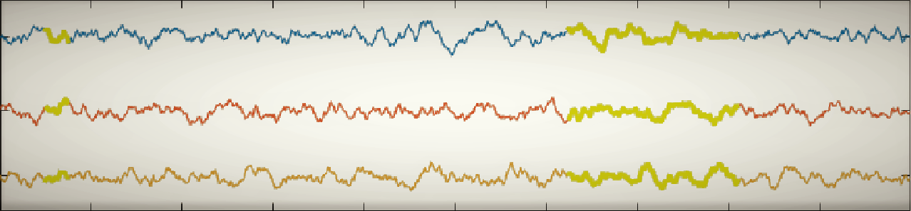
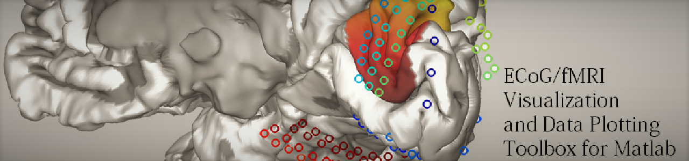

My research at Leon Deouell's [Human Cognitive Neuroscience Lab](https://www.hcnl.org/) was about how the human visual cortex represents visual stimuli over sustained periods of time. The links below contain a selection of guides, tools, functions and analysis pipelines that I developed over the course of my PhD.

## Publications
* [Cortical representation of persistent visual stimuli](https://doi.org/10.1016/j.neuroimage.2017.08.028)
* [Non-Sinusoidal Activity Can Produce Cross-Frequency Coupling in Cortical Signals in the Absence of Functional Interaction between Neural Sources](https://doi.org/10.1371/journal.pone.0167351)
* [Human posterior parietal cortex responds to visual stimuli as early as peristriate occipital cortex](https://doi.org/10.1111/ejn.14164)
* [Sustained High- and Low-Frequency Neural Responses to Visual Stimuli in Scalp EEG](https://www.biorxiv.org/content/10.1101/290593v1)
* fMRI BOLD responses to prolonged visual stimuli across the ventral visual stream (unpublished)

## How to plan and run an fMRI experiment

My complete guide to planning and running an fMRI experiment (with Matlab experiment code template).

## How to analyze fMRI Data

My complete guide to analyzing and visualizing fMRI data using FreeSurfer and FSFast (with analysis pipeline code template).

## Functions for time series analysis and statistics (MATLAB)

A wide array of Matlab functions, focused on EEG analysis but should be widely applicable. Include functions for plotting, testing, manipulating and generating data.

## ECoG/fMRI visualization and data plotting toolbox (MATLAB)

Toolbox for visualizing 3D brain models in Matlab, as well as to flexibly plot data on and around the brain surfaces.
