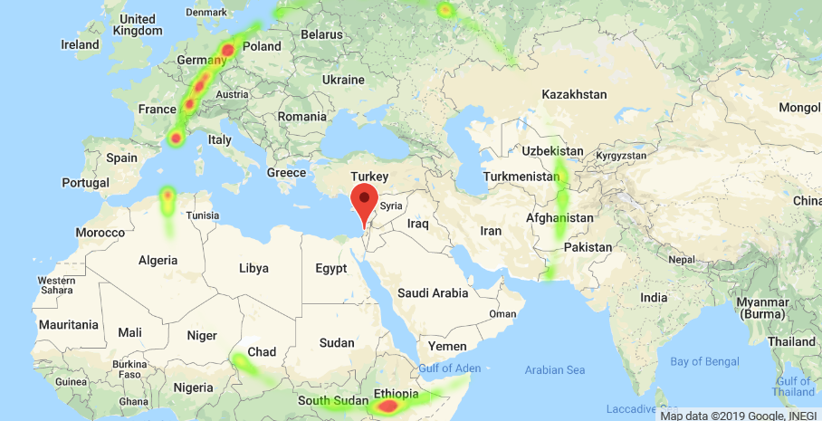
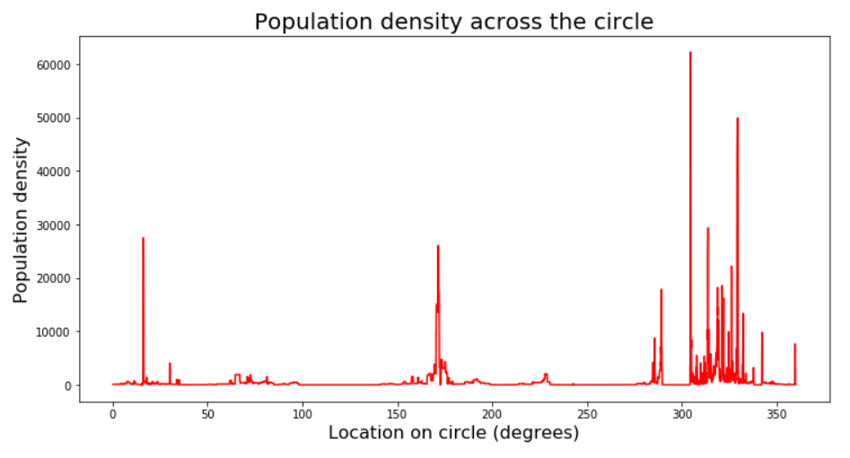
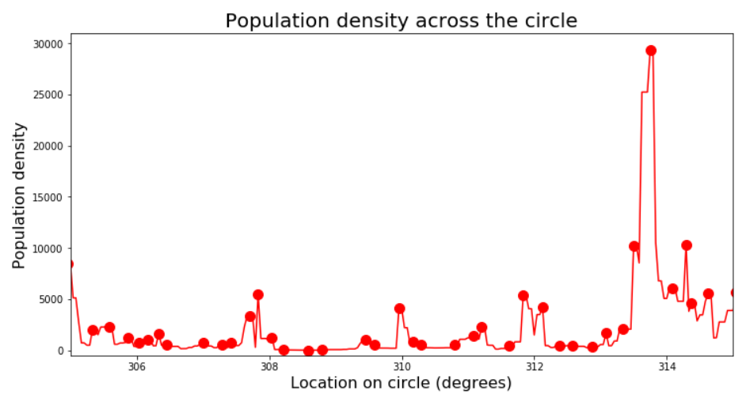
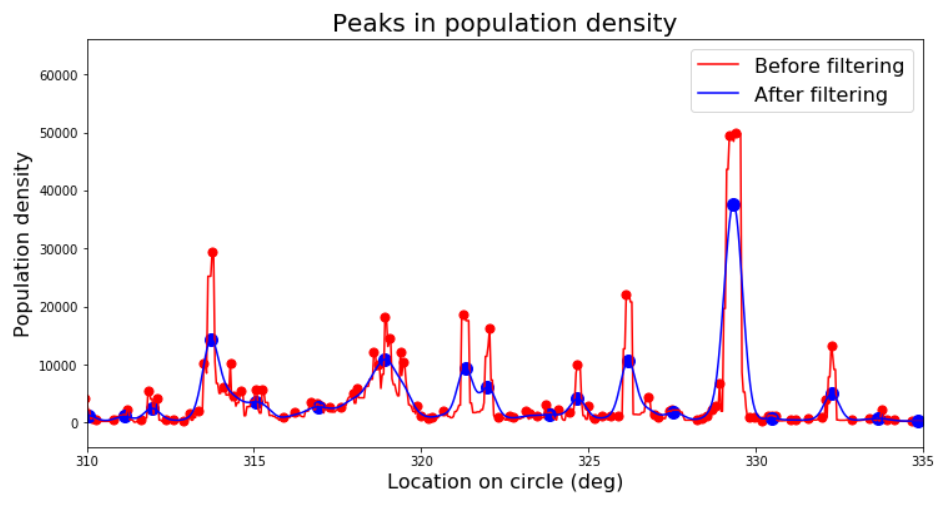
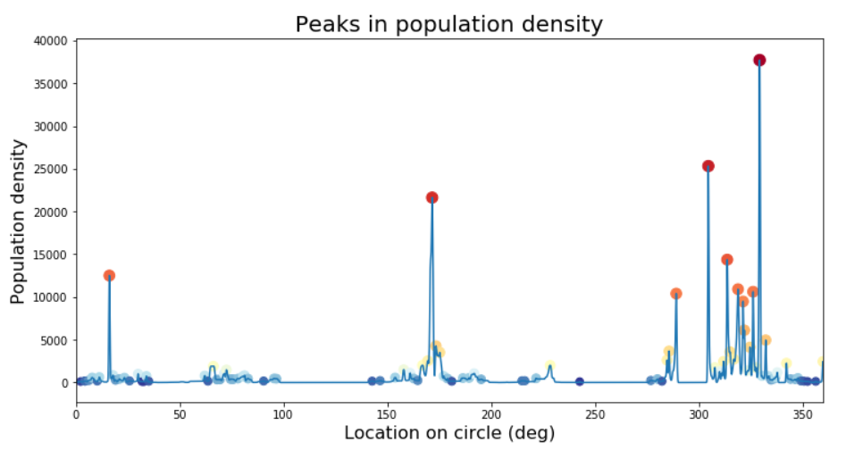
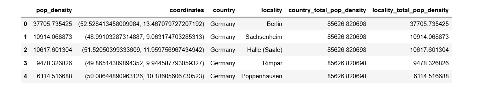
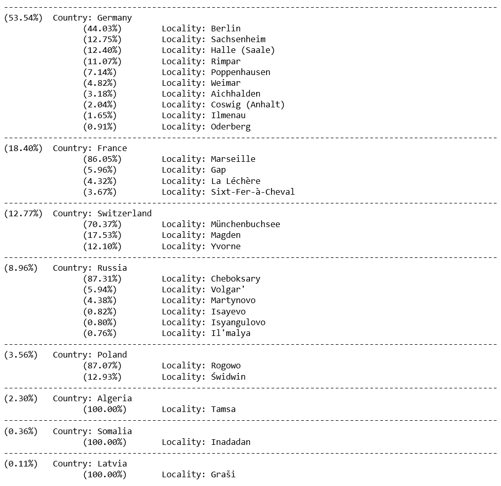
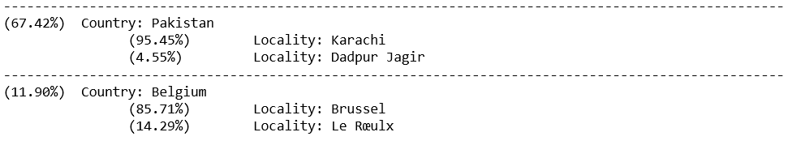

If I say I'm 50 km from your location, would you be able to guess where I am?

This question came up as I was chatting with someone on a popular dating app. This app, like others of its kind, is based on users' location, and so displays the distance of potential matches from your location. This particular person happened to be traveling for work about 2800 km away at the time, and as I tried to guess where they were visiting, I occurred to me that a bit of data and coding can make this game much easier.

This turned out to be a very entertaining one-day project, that had me looking into world population data, sphere geometry, google maps API, and even signal processing. This is the idea: given that a person is located in unknown coordinates on Earth _(lat<sub>2</sub>, long<sub>2</sub>)_ but with known distance from a location _(lat<sub>1</sub>, long<sub>1</sub>)_, how can we best guess _(lat<sub>2</sub>, long<sub>2</sub>)_? My approach was to use world population density data, and assign probabilities to locations based on this density.

## First stop: NASA

First we need some data. I ended up on [NASA's Socioeconomic Data and Applications Center (SEDAC)](https://sedac.ciesin.columbia.edu/) website, where I found the Gridded Population of the World (GPW) v4.11 data set ([download here](https://sedac.ciesin.columbia.edu/data/set/gpw-v4-population-density-rev11/data-download), free registration required). Several resolutions are available - a 2.5 minute (about 5km; a minute is 1/60 of a degree) grid seemed good enough to me without having to deal with a heavy dataset.

It's an ASCII file containing 4320 rows and 8640 columns of numbers, corresponding to population density estimates for a square grid covering the Earth's surface (180&deg; of latitude and 360&deg; of longitude in steps of 2.5 Minutes, or 0.04167&deg;). It also contains six header lines. Non-land locations are coded as -9999, which we'll replace with NaN (I'm using Python; import commands are placed where they are first required for clarity).

```python
import numpy as np

# Read global population density data
data_path = 'data\gpw-v4-population-count-rev11_2020_2pt5_min_asc\gpw_v4_population_count_rev11_2020_2pt5_min.asc'
data = pd.read_csv(data_path, skiprows=6, sep=' ', header=None, usecols=np.arange(8640), na_values=-9999)
```

Our strategy will be to:
1. **Choose a center location and distance**
2. **Retrieve all population density grid entries that fall on the corresponding circle on Earth**
3. **Compute probabilities for discrete location labels - using Google Maps' API to translate numerical coordinates to rich location data.**

## Doing the math

This is where I ran into the first challenge: on a spherical coordinate system, how do we compute the set of coordinates that make up our circle of equidistant points? After a very short attempt with pen and paper and trying to recall some trigonometry, that most useless of high school subjects, I quickly realized that this is not a simple problem. Not simple, of course, only in the sense that it means I had to [look up the formulas online](https://www.movable-type.co.uk/scripts/latlong.html) rather than figure it all out myself. So here is a function that translates a center point, distance and angle to the corresponding target coordinate on the circle circumference:

```python
import math

EARTH_RADIUS = 6371

def target_coord(center_coord, angle, distance_km, sphere_radius_km=EARTH_RADIUS):

    # First convert everything to radians and to shorter names
    x1 = math.radians(center_coord[0])
    y1 = math.radians(center_coord[1])
    theta = math.radians(angle)
    d = distance_km
    R = sphere_radius_km

    # Apply formulas
    x2 = np.arcsin(np.sin(x1)*np.cos(d/R)+np.cos(x1)*np.sin(d/R)*np.cos(theta))
    y2 = y1 + np.arctan2(np.sin(theta)*np.sin(d/R)*np.cos(x1),np.cos(d/R)-np.sin(x1)*np.sin(x2))

    # Convert results back to degrees and normalize
    target_latitude = np.mod(math.degrees(x2)+270,180)-90
    target_longitude = np.mod(math.degrees(y2)+540,360)-180
    return target_latitude, target_longitude
```

## Putting it together

Next, let's add a couple of utility functions to convert earth coordinates to row and column in our dataset and vice versa (actually we'll never use _index_to_coord_ - it's here just for completeness):

```python
def coord_to_index(latitude, longitude, data_size):
    num_rows = data_size[0]
    num_cols = data_size[1]
    row_idx = int(np.mod(np.round((-latitude + 90)/180 * num_rows), num_rows))
    col_idx = int(np.mod(np.round(( longitude+180)/360 * num_cols), num_cols))
    return row_idx, col_idx

def index_to_coord(row_idx, col_idx, data_size):
    num_rows = data_size[0]
    num_cols = data_size[1]
    longitude =  col_idx/num_cols*360 - 180
    latitude  = -row_idx/num_rows*180 + 90
    return latitude, longitude
```

Now we can define a center point and distance and sample our circle. But how many points to sample? Obviously, we gain nothing by sampling with higher resolution than that of the dataset, so my quick-and-dirty solution was to select the maximal resolution that samples each entry on the circle at least once, which is simply _np.max(data.shape)_ (corresponding to the number of grid squares on the maximal circumference possible, e.g. the equator).
Let's use the parameters from the case I started with - a distance of 2850km from my (approximate) location in Jaffa, Israel:

```python
# choose input parameters
distance = 2850
center = (32.05, 34.75)

# initialize location and population density arrays
circumference = 2 * np.pi * distance
n_samples = int(np.max(data.shape)) # this ensures that we sample at least equal to the data resolution
locations = [np.nan]*(n_samples)
pop_density = np.zeros(n_samples)

# for each sampled point, record the coordinates touple and the population density
for idx, angle in enumerate(np.linspace(0, 360-(360/n_samples), num=n_samples)):
    target = target_coord(center, angle, distance)
    locations[idx] = target
    row_idx, col_idx = coord_to_index(target[0],target[1], data.shape)
    pop_density[idx] = data[col_idx][row_idx]

# handle NaNs
pop_density[np.isnan(pop_density)] = 0
```

## It's map time

With a set of coordinates and population density values, we are ready to plot our preliminary results on a map!
We'll handle this aspect using the _gmaps_ and _geopy_ libraries. Note that to access Gmap's API, we need to generate an API key. I already had a Google Cloud account so doing this was simple using [these instructions](https://developers.google.com/maps/documentation/embed/get-api-key). Make sure you get your own key if you want to run this code yourself.
This is what we need to set up:

```python
import gmaps
import geopy

API_KEY = '<my key...>'
gmaps.configure(api_key=API_KEY)
geocoder = geopy.geocoders.GoogleV3(api_key=API_KEY)
```
I also had to run this to enable the Google maps to display within my Jupyter Notebook (required a computer restart).

```python
!jupyter nbextension enable --py --sys-prefix widgetsnbextension
!jupyter nbextension enable --py --sys-prefix gmaps
```

Okay, now for the actual plotting, using a heatmap layer to show the population density values:
```python
# plot on map
fig = gmaps.figure()
markers = gmaps.marker_layer([center])
fig.add_layer(markers)
heatmap_layer = gmaps.heatmap_layer(locations, weights=pop_density)
fig.add_layer(heatmap_layer)
fig
```

...And here we are!



## Smoothing out the details

Our next task is to take this array and translate it into a list of probabilities for possible discrete locations. We need to define what we mean by "location", so let's say our desired resolution is city-level (which is suitable given our ~5km grid resolution). Ideally, we could extract (using the geopy library) the country/city label for each point on our circle, add up the population density values belonging to each unique location, and divide each by the total density across the array to get a probability between 0 and 1. This is because if a city is large enough to span several samples, the probability to be in this city should be the sum of the probabilities of being in each of its sampled points.

However, we run into a technical issue here - the Google Maps API doesn't seem to to like it when we send thousands of location data requests at the same time. Despite some attempts to go around this, I just ended up getting a 'Service timed out' error each time. Instead then, let's take another approach.

Rather than integrating across all locations along the circle, we can look just at peaks of population density. This of course changes what we are effectively looking for (e.g. we will not be sensitive to large but sparsely-populated locations), but it should be good enough. To start with, let's look at what we are working with:

```python
import matplotlib.pyplot as plt

x_axis_values = np.linspace(360/n_samples,360,n_samples)

plt.figure(figsize=[12,6])
plt.plot(x_axis_values, pop_density, c='r')

plt.xlabel('Location on circle (degrees)', size=16);
plt.ylabel('Population density', size=16);
plt.title('Population density across the circle', size=20);```
```



So what we have here is a time series - or rather a space series if you will. We can see the peak clusters that correspond to the blobs in Russia, Ethiopia and Europe in the map above (angle 0 is right above the center). With my scientific background analyzing biological time series data, I feel right at home here... I also know that I can't just run a peak-finding function on this series, since it is very non-smooth and so there are peaks everywhere - in the sense of samples that are simply higher than their immediate neighbors.

Let's see this happening (and zoom in for clarity):

```python
from scipy import signal # this library has the find_peaks function

peak_indexes = signal.find_peaks(pop_density)[0]
peak_values = pop_density[peak_indexes]

plt.figure(figsize=[12,6])
plt.plot(x_axis_values, pop_density, c='r')

plt.scatter(x_axis_values[peak_indexes],peak_values, c='r', s=100);
plt.xlabel('Location on circle (degrees)',size=16);
plt.ylabel('Population density',size=16);
plt.title('Population density across the circle', size=20);
plt.xlim([305, 315]);
```



_find_peaks_ has parameters we can play with to narrow down the results, like minimal height, minimal distance from other peaks, and so on. Rather than get into that, I prefer to look at the problem from a signal processing perspective and simply apply a smoothing filter. This has the advantages of not only getting rid of this pesky quantization noise in the signal, but also introducing a bit of spatial integration - that is, the value at each point will reflect not only the density at this point but also a weighted sum of neighboring points (since any smoothing - i.e. "low pass" - filter is basically a moving weighted average). This works for us because by going with the "peaks" approach we're basically ignoring the data around the peaks.

What kind of filter to use? Common filters used in signal processing such as the Butterworth or Chebychev filters are good if you care about the precise frequency spectrum of your output, but they pay for that by introducing some distortions (e.g. "ringing" around square waves) that we want to avoid (as they may create artificial peaks). A simple Gaussian filter is probably the best option in our case.

We need to select one parameter - the standard deviation (width) of our Gaussian, corresponding to the degree of smoothing. A width of 5km makes sense and seems to generate good results - let's compare the signals and detected peaks before and after filtering (again zooming in, and let's also add a minimal height criterion to find_peaks to get rid of very low peaks):

```python
from scipy import ndimage # the gaussian filter is part of the image processing library

filter_width_km = 5
pop_density_smoothed = np.zeros(pop_density.shape)
ndimage.filters.gaussian_filter(pop_density, filter_width_km, output=pop_density_smoothed)

min_height = 100
peak_indexes_nonsmoothed = signal.find_peaks(pop_density, height = min_height)[0]
peak_values_nonsmoothed = pop_density[peak_indexes_nonsmoothed]

peak_indexes_smoothed = signal.find_peaks(pop_density_smoothed, height = min_height)[0]
peak_values_smoothed = pop_density_smoothed[peak_indexes_smoothed]

# Compare original to filtered signal:
plt.figure(figsize=[12,6])
plt.plot(x_axis_values, pop_density, c='r')
plt.plot(x_axis_values, pop_density_smoothed, c='b')

plt.scatter(x_axis_values[peak_indexes_nonsmoothed],peak_values_nonsmoothed, c='r', s=50);
plt.scatter(x_axis_values[peak_indexes_smoothed],peak_values_smoothed, c='b', s=100);
plt.xlabel('Location on circle (deg)',size=16);
plt.ylabel('Population density',size=16);
plt.title('Peaks in population density', size=20);
plt.legend(['Before filtering','After filtering'], fontsize=16);
plt.xlim([310, 335]);
```



Looking at the entire circle again, and with some nicer graphics:

```python
# Plot peaks on our circle
plt.figure(figsize=[12,6])
plt.plot(x_axis_values, pop_density_smoothed)
plt.scatter(x_axis_values[peak_indexes_smoothed],peak_values_smoothed, c=-np.log(peak_values_smoothed+1), s=10*np.log(peak_values_smoothed+1), cmap='RdYlBu');
plt.xlabel('Location on circle (deg)',size=16);
plt.ylabel('Population density',size=16);
plt.title('Peaks in population density', size=20);
```



## Going local

Okay, that was fun but we still have the main part of the algorithm ahead of us. Next we need to extract the location information from each peak's coordinates. For this we'll need the following functions that extract country and city (coded as by Google "locality" as not every place is within a city) from the gmap data structure.

```python
def get_country(Location):
    country = np.nan
    for loc_info in Location.raw.get('address_components'):
        if 'political' in loc_info.get('types'):
            country = loc_info.get('long_name')
        if 'country' in loc_info.get('types'):
            country = loc_info.get('long_name')           
    return country

def get_locality(Location):
    locality = np.nan
    for loc_info in Location.raw.get('address_components'):
        if 'locality' in loc_info.get('types'):
            locality = loc_info.get('long_name')
    return locality
```

We'll store our results in a Pandas dataframe:

```python
import pandas as pd
# Create data frame for candidate locations
peak_locations = [locations[i] for i in peak_indexes_smoothed]
candidate_locations = pd.DataFrame({'pop_density' : peak_values_sm, 'coordinates' : peak_locations, 'country' : np.nan, 'locality' : np.nan})

# Go over candidate locations and extract country-locality labels
for index, row in candidate_locations.iterrows():
    Location = geocoder.reverse(row.coordinates, exactly_one=True, language='en', timeout=None)
    candidate_locations.loc[index,'country'] = get_country(Location)
    candidate_locations.loc[index,'locality'] = get_locality(Location)

# Filter out null countries (usually in ocean)
candidate_locations.dropna(axis=0, inplace=True)
```

This is now what our dataframe looks like:



We could wrap up here and simply sort by _pop_density_ to get our final suggestions. But we'll go a bit further and handle the case of non-unique rows. That is, the case that there are multiple peaks within the same locality. Although it's a bit problematic to do this after abandoning the idea of continuous integration in favor of focusing on peaks (as it unjustifiably biases our results toward localities that have multiple distinct density peaks), let's just go ahead and sum these together, using of course the awesome power of groupby.
At the same time, it makes sense to separate our results into multiplicative country and locality probabilities - such that the probability for a country is the sum of probabilities of locations within it, and probabilities for localities are computed within their respective countries. This is also easily accomplished with groupby.

```python
# The probability for each country should be aggregated across all its locations, so add summed pop density for countries and localities
candidate_locations['country_total_pop_density'] = 0
candidate_locations['locality_total_pop_density'] = 0
for cname, cgroup in candidate_locations.groupby('country'):
    country_total_pop_density = cgroup.pop_density.sum()
    candidate_locations.loc[candidate_locations.country==cname,'country_total_pop_density'] = country_total_pop_density

    for lname, lgroup in cgroup.groupby('locality'):
        locality_total_pop_density = lgroup.pop_density.sum()
        candidate_locations.loc[np.logical_and(candidate_locations.country==cname, candidate_locations.locality==lname),'locality_total_pop_density'] = locality_total_pop_density

# We'll use this to compute the individual country probabilities:
total_pop = candidate_locations.pop_density.sum()
```

Last thing before displaying the results - let's get them sorted in descending order. \
```python
# Sort by country_total_pop_density, then by locality_total_pop_density
candidate_locations.sort_values(['country_total_pop_density','locality_total_pop_density'], inplace=True, ascending=False)
candidate_locations.reset_index(inplace=True, drop=True)
```

## Drumroll please

...Aaand print!

```python
# Display results with probabilities:
for cname, cgroup in candidate_locations.groupby('country', sort=False): # sort=False because we want to keep our previous sort (not alphabetical)
    pop_within_country = cgroup.country_total_pop_density.mean() # the value is the same for all members of the group, so 'mean' just extracts this value
    perc = pop_within_country/total_pop*100
    print('-'*100)
    print('(%.2f%%) ' %(perc) + (' ' if perc<10 else '') + ' Country: ' + cname)
    for lname, lgroup in cgroup.groupby('locality', sort=False):
        pop_within_locality = lgroup.locality_total_pop_density.mean()
        perc = pop_within_locality/pop_within_country*100
        print('\t\t(%.2f%%) ' %(perc) + (' ' if perc<10 else '') + ' \tLocality: ' + lname) # Some formatting to make sure the columns are aligned. Is there maybe a better way to do this...?
```



So our most likely result is Germany with 53.5%, with Berlin being the most likely location within this country. Incidentally, this is indeed where my conversation partner was at the time, so that's nice and validating.

But what if they happened to be a bit further away, say in Brussels, Belgium (3245km)? Well, since our algorithm cares about nothing but population density, our answer would have been very different:



This would of course be wrong if the other person was an Israeli citizen like myself, implying a strong prior probability against Karachi. So on a final note, how could we take this little project further if we wanted it to take advantage of additional knowledge that we may have? One idea that comes up is to use international travel statistics - what is the volume of travel between pairs of countries - and generating from it a probability prior (assuming of course that we know the target individual's nationality). Of course, having two or more sets of probabilities means that I need to decide how to weigh them. I could try to learn these weights or even use a more complex prediction model using each set as a feature - though this would make it a supervised learning problem requiring labeled data of people's distances and locations. In other words, it's doable but somebody will have to pay me for it :)

## To sum up

This was a fun and educational little project. I enjoyed taking a simple idea and carrying it all the way to a working solution, discovering along the way how not so simple it actually is. As for the text conversation that sparked this idea, unfortunately it never became more than that. Oh well...
