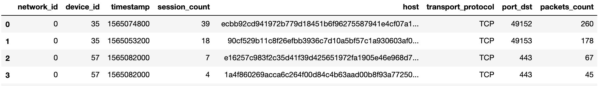
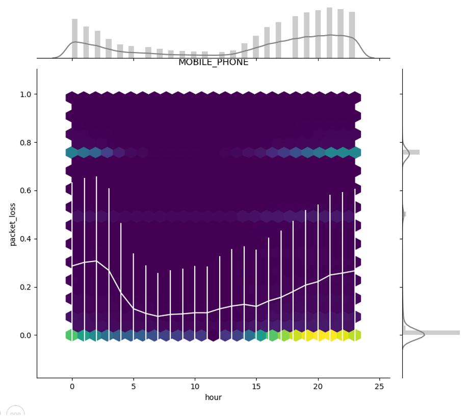
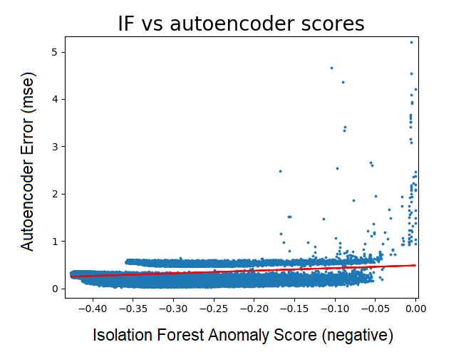
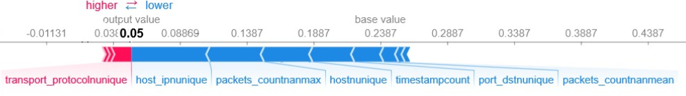

## My first hackathon
A few weeks ago I had a chance to participate in my first data science hackathon - [Datahack 2019](https://www.datahack.org.il/), which took place in Jerusalem. I joined a good friend and previous graduate of my lab as the final member of a team incidentally composed almost entirely of neuro/biology PhD graduates, and we signed up for the ["devices gone rogue" anomaly detection challenge](https://www.datahack.org.il/challenge/armis-devices-gone-rogue) presented by [Armis](https://www.armis.com/).

With two free days before the event that I could spend studying ahead, I came very prepared having read anything that I could find about common approaches to anomaly detection problems and with a few ideas of my own. The event itself was a great deal of fun, I got to know some wonderful teammates and we eventually ended up on the 2nd place for this challenge.

## The devices-gone-rogue challenge

Armis's product is an IoT security platform, that identifies threats coming from any type of device in an organization's network (phones, printers, smart televisions, vehicles, medical instruments, etc.). Appropriately, the [challenge](https://github.com/armis-security/DataHack2019) presented in the Datahack was to determine, based on a large database of network traffic events, devices with suspicious (i.e., anomalous) behavior.

Our team's solution, along with explanation and even a PPT presentation, is available on github: [https://github.com/YG15/DataHack2019] (credit due to my team members [Tali Shrem](https://www.linkedin.com/in/talia-shrem-84a404a9/), [Guy Sheffer](https://www.linkedin.com/in/guy-sheffer-79761634/), [Yonathan Guttel](https://www.linkedin.com/in/yonathan-guttel/), [Inbal Meir](https://www.linkedin.com/in/inbal-meir-177b5516/) and myself).

By the way, the 1st place solution can be found [here](https://github.com/dmarcous/Self-Supervised-Network-Anomaly-Detection?fbclid=IwAR02I0JsfydDS1ud7uHezbw9CbwZWBNROpRTlmY54os0bEmDtV0daw2dfa0). Achieving an area-under-the-ROC-curve of ~0.9 compared to our 0.87, it is a great deal more complex and incorporates domain-expertise-based feature engineering and model ensembling. Worth a look.

## Our solution
Fairly quickly into the work we decided on a simple pipeline comprising of data exploration, feature engineering, and modeling with isolation forest (optionally ensembling other models later). By dividing ourselves among the different tasks, it was easy to start with some initial features and a simple model to establish the workflow, and then gradually add to it as each update is carried downstream along the already-established pipeline.

### Exploring the data
The data included traffic from five consecutive days and four different networks. Our first priority was to understand how these time and space properties impact the data: is there a daily cyclic traffic pattern for some device types? should similar devices on different network be modeled separately or should their data be pooled together? The former question is particularly relevant for anomaly detection, since if different times of day correspond e.g. to different traffic volume baselines, this variance can be regressed out so that it would not mask local rather than global outliers.  

Overall, traffic features tended to stay uniform across the day, with some notable exceptions. For example, packet loss for mobile phones was higher during peak traffic hours than during the night (error bars indicate standard error across days):

No differences were found between days or networks; we therefore handled this variance by subtracting from each traffic parameter its hour-specific mean, pooling data from all days and networks.

### Feature engineering and selection

Each device that had to be assigned an anomaly score had data for multiple sessions each comprising summary data for a single hour-session (for example, a device's outbound byte count was described using mean, median, std. deviation, min and max for a given hour). Multiple sessions meant that another layer of summary was required (for example, the outbound byte count mean could be again averaged across sessions). Aggregating data across sessions using mean, median, min and max, we naturally ended up with a lot of somewhat similar features (e.g. mean across sessions of inbound_packet_size_max, and max across sessions of inbound_packet_size_mean...). With some trial and error we found that our isolation forst model works better when we use only some of the features (by the time we aggregated session-based data into device-based data, we were down from million of rows of data to only about 70K, which apparently meant that the model could not had the data to spare chasing down too many irrelevant paths along its trees).

How to select the best feature combination? Isolation Forest runs pretty fast, so under different circumstances even a brute force approach of trying out possible combinations could have worked, but we did not have that kind of time. Instead we used a mix of intuitive feature selection (for example, since we are looking for outliers, means, mins and medians were mostly discarded in favor of max values) and manual testing of different feature combinations.

Surprisingly, our final model made use of _only 7 features_ (mostly having to do with outbound traffic volume, temporal range of activity across the week and number of unique protocols/port numbers). This feature combination outperformed similar selections with a larger number of features.

#### The model

Isolation Forest is a natural solution for this kind of problem. It works by generaing trees whereby at each node the data is split along a random dimension and a random cutoff point between the min and max value. Since samples that are easily isolated (e.g. they lie far from most other samples along one or more dimensions) would become the only sample in the node after fewer splits, the average path length to isolation is used as an anomaly score (e.g. smaller values indicate higher probability of anomaly). The algorithm is quite fast since unlike for decision trees, no search is required to decide on each split, and the trees are developed only up to their expected mean path length of log2N as no anomalies are expected for longer paths.

One of the ideas I had preparing for the datahack was to try using an autoencoder model. An autoencoder is a neural network that learn an identity function (i.e. the output layer should be identical to the input layer) but with a hidden layer smaller than the input/output layers. This effectively accomplishes a compressed representation of the data in the hidden layer, which is then decoded back to the output layer as the input + some decoding error. The rationale of using this architecture for anomaly detection is that putting anomalies through the trained network would result in larger decoding errors, since their features behave in an unexpected way relative to each other.

The problem with this approach in the current case is that autoencoders require a supervised, anomaly-free dataset to train on, while our data was mixed and unlabeled. However, this problem can be partially overcome using the results of the isolation forest: since the isolation forest provides us with a continuous anomaly score, we could set the threshold arbitrarily low such that we can expect to capture the majority of anomalies (along with a large number of false positives). The remaining dataset can be then trusted to be relative anomaly-free, and used to train the autoencoder.

It's a nice idea in theory, but the actual results were unfortunately quite poor. Looking across the dataset, there was definitely some correlation between the anomaly score provided by the isolation forest and the decoding error of the autoencoder (averaged across features) - but the latter performed very poorly against the leaderboard.

#### Explaining the results

One of the evaluation parameters of the challenge was explainability of the results. We used the shap library to easily compute SHAP values that portray the degree to which each feature moved the anomaly score of a device toward a positive or negative value:

Computing SHAP values using the shap library takes a few seconds for each sample, and provides an _approximation_ of the real [Shapley values](https://en.wikipedia.org/wiki/Shapley_value) that precisely reflect the contribution of each feature to the final result (averaged across all possible combination of features). This made me curious whether in this and other cases (when there are few features and model training is relatively fast) when it makes more sense to compute the exact Shapley values by actually re-training the model using every possible feature combination. I will expand on this topic in my next post.
