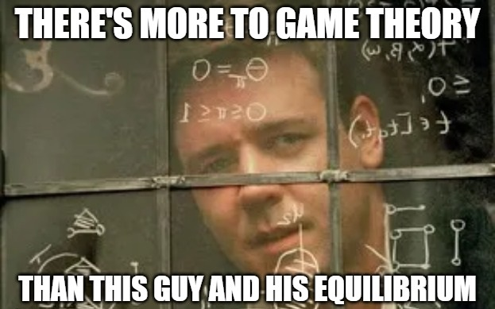
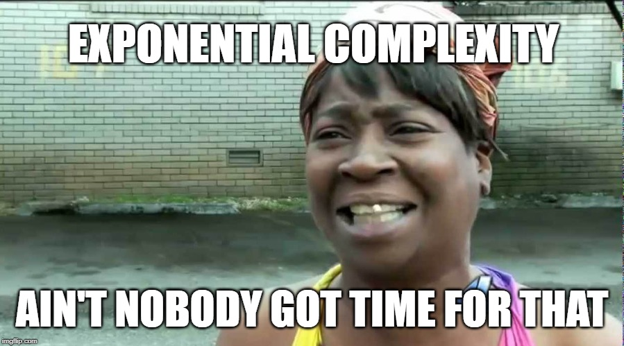
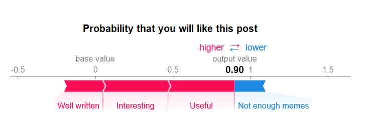

## What is this post about?


This post is the first in a series of two (or three) posts about explaining statistical models with Shapley values. I can think of two main reasons you might want to read it (apart from, you know, fun):
1. **To learn about Shapley values and the SHAP python library**. This is what this post is about after all. The explanations it provides are far from exhaustive, and contain nothing that cannot be gathered from other online sources, but it should still serve as a good quick intro or bonus reading on this subject.
2. **As an introduction or refresher before reading the next post about radical Shapley values**. The next post is my attempt at a novel contribution to the topic of Shapley values in machine learning. You may be already familiar with SHAP and Shapley and are just glancing over this post to make sure we're on common ground, or you may be here to clear up something confusing from the next post.

## What are Shapley Values?



A quick Google search will provide numerous other sources online that explain this topic very well, so my explanation here will be brief. I specifically recommend [this chapter](https://christophm.github.io/interpretable-ml-book/shapley.html) of [Interpretable Machine Learning](https://christophm.github.io/interpretable-ml-book/) by Christoph Molnar for a more detailed explanation. I also found that staring at the mathematical formula (below or on [Wikipedia](https://en.wikipedia.org/wiki/Shapley_value)) until I got it gave me the best intuition.

The Shapley value is a concept from game theory, describing how the contribution to a total payoff generated by a coalition of players can be distributed among the players. Its definition is quite straightforward: the contribution of any player is the expected value, across all possible coalition of players not containing this player, of the prediction change caused by adding this player to the coalition. It looks like this:

{% include figure image_path="../assets/images/shapley/shapley-formula.png" alt="Shapley value formula" caption="_&phi;<sub>i</sub>_ is the Shapley value for player _i_, _S_ is a coalition of players, _v(S)_ is the payoff for this coalition, and N is the total number of players. _N\\{i}_ is all the possible coalitions not containing _i_. The first term within the sum corresponds to the fraction of times _S_ appears within the possible player permutations; intuitively, this gives the highest weight to the most informative contributions of a player, i.e. when it is either isolated or when it is added to an otherwise full coalition. " %}

**Let's look at an example**: say we have a team that needs to perform a task. Each individual on the team contributes an additive 20% chance of success on the task, but one team member, _A_, has a special tool that guarantees a 90% chance of success, as long as there is at least one additional member on the team. If our team today is made up of three members, _A_, _B_, and _C_ - having together a 90% chance of success - how much does each one contribute to this chance?

Let's compute this for team member _C_, using all possible combinations not containing them:

|| Coalition without _C_ || Chance without _C_ || Coalition with _C_ ||  Chance with _C_ || Change in chance after adding _C_ ||
||---    ||: --- ||: --- ||: ---||: ---||
|| { }   || 0%      || {C}      || 20%   || **20%** ||
|| {A}   || 20%     || {A,C}    || 90%   || **70%** ||
|| {B}   || 20%     || {B,C}    || 40%   || **20%** ||
|| {A,B} || 90%     || {A,B,C}  || 90%   || **0%**  ||

Applying the formula (the first term of the sum in the Shapley formula is 1/3 for {} and {A,B} and 1/6 for {A} and {B}), we get a Shapley value of **21.66%** for team member _C_. Team member _B_ will naturally have the same value, while repeating this procedure for _A_ will give us **46.66%**. A crucial characteristic of Shapley values is that players' contributions always add up to the final payoff: **21.66% + 21.66% + 46.66% = 90%**.

## Shapley values in machine learning
**The relevance of this framework to machine learning is apparent if you translate _payoff_ to _prediction_ and _players_ to _features_.**. But computing Shapley values for model features is not entirely straightforward, because features in a model do not behave the same way as workers in a team. Specifically, **a predictive model cannot typically handle one of its input features being simply removed in order to test how its output changes as a result**. Instead, ML implementations of Shapley values and specifically the SHAP method, interpret _missing features_ as _features whos value is unknown_, and simulate this unknown state by averaging over possible values of the feature (the next post in this series proposes a different approach and compares it to the SHAP method).

**The main problem with deriving Shapley values is computational complexity** - specifically, the fact that they require 2<sup>num. features</sup> steps to compute. No matter how beefed-up your GPU is, exponential complexity is almost always a deal breaker (just think how many steps this is when your features are for instance 20x20 image pixels). In the theoretical literature, this problem is most commonly addressed by sampling methods - rather than going over all possible feature coalitions, estimate the Shapley value using a sub-sample of them (if you are interested in this see for example [Castro et al. 2009](https://www.sciencedirect.com/science/article/pii/S0305054808000804), [Castro et al. 2017](https://www.sciencedirect.com/science/article/pii/S030505481730028X) or [Benati et al. 2019](https://www.sciencedirect.com/science/article/abs/pii/S0377221719304448)).



## Enter the SHAP python library
The [SHAP library](https://shap.readthedocs.io) is a recent and powerful addition to the data scientist's toolkit. It provides three main "explainer" classes - TreeExplainer, DeepExplainer and KernelExplainer. The first two are specialized for computing Shapley values for tree-based models and neural networks, respectively, and implement optimizations that are based on the architecture of those models. The kernel explainer is a "blind" method that works with any model. I explain these classes below, but for a more in-depth explanation of how they  work I recommend [this text](https://christophm.github.io/interpretable-ml-book/shap.html).

### KernelExplainer
The KernelExplainer's approach to computing Shapley values can be summed up in these two main points:
1. **Instead of iterating over all 2<sup>M</sup> possible feature permutations, it samples a small subset**. The default number of samples is _nsamples=2*M+2048_. So if we have, for instance, 20 features, KernelExplainer will sample 2088/2<sup>20</sup> or about 0.2% of the possible coalitions. Coalitions are not selected completely randomly; rather, those with higher weight in the Shapley formula will be selected first (so, coalitions of 0 or M-1 features, which are most informative about the effect of adding  another feature, will be included first).
2. **"Missing features" are simulated by averaging the model's prediction over bootstrapped samples with values for these features taken from other entries in the data set.** This "background" dataset has no default size but the algorithm suggests 100 samples. This means that for each sampled feature coalition, the algorithm will generate 100 predictions, each based on a bootstrapped sample, and average over them. Note that the fact that the KernelExplainer's result is based solely on outputs of the model for different inputs, means that it will work for any kind of function without making any further assumptions about it.

**The significance of (1)** is that Shapley values are basically estimated using random sampling. Appropriately, increasing _nsamples_ (or the size of the background dataset) leads to increased runtime (more or less linearly) and decreased variance in the estimation (meaning that when you run the explainer multiple times, the Shapley values will be more similar to each other and to the expected value). This is easily demonstrated by running the Kernel Explainer with different _nsamples_ values:



**The significance of (2)** - handling "missing" features by replacing their values with surrogate "background" data - is more complex:
* First and most simply, it is an **additional source of variance** to the Shapley value estimation, as the results are to at least some extent dependent on the selection of the background dataset.
* Second, it makes an **assumption about feature independence**: if for example features _x<sub>1</sub>_, _x<sub>2</sub>_ are highly correlated in our training data, replacing values of  _x<sub>1</sub>_ with random ones from the background dataset ignores this dependence and generates predictions based on {_x<sub>1</sub>_, _x<sub>2</sub>_} instances which are not likely to appear in the training set, making the SHAP value estimation less reliable.
* And finally, it represents an **interpretation of feature contribution to the prediction** not as how they affect the prediction model itself, but rather how they affect the result of the already-trained model if the values of these feature were unknown. Another great opportunity to remind you that this all leads to the next post where a different interpretation is explored.


### TreeExplainer
TreeExplainer is a class that computes SHAP values for tree-based models (Random Forest, XGBoost, LightGBM, etc.). Compared to KernelExplainer it is:
1. **Exact**: Instead of simulating missing features by random sampling, it makes use of the tree structure by simply ignoring decision paths that rely on the missing features. The TreeExplainer output is therefore deterministic and does not vary based on the background dataset.
2. **Efficient**: Instead of iterating over each possible feature combination (or a subset thereof), all combinations are pushed through the tree simultaneously, using a more complex algorithm to keep track of each combination's result - reducing complexity from _O(TL2<sup>M</sup>)_ for all possible coalitions to the polynomial _O(TLD<sup>2</sup>)_ (where _M_ is the number of features, _T_ is number of trees, _L_ is maximum number of leaves and _D_ is maximum tree depth).

What have we gained by using TreeExplainer? First, **we got rid of all the sampling-based estimation variance**, in that we don't need to use a background dataset or select a subset of feature coalitions. Second, our results are **no longer skewed due to dependencies between features**, since these are contained in the tree structure (although under some circumstances, we may have to waive both of the previous benefits). Third, **our run time is _significantly_ faster**, in some cases making the difference between _pretty fast_ and _unacceptably slow_. Finally, note that there is no difference between the two explainers in terms of their interpretation of feature contributions being in respect to the predictions of a given trained model, rather than in respect to how they affect the model itself.


### Wait, what about DeepExplainer?
DeepExplainer is a class specialized for computing SHAP values for neural network models. I am not including a detailed explanation of it here because 1. I lack the hands-on-experience I have with the other explainers that allows me to vouch for my explanations of them, and 2. this post is mainly a preamble to the next one where the radical Shapley method is compared to the SHAP explainers, and this comparison is largely irrelevant when it comes to explaining neural networks.

As a rough overview, the DeepExplainer is much faster for neural network models than the KernelExplainer, but similarly uses a background dataset and the trained model to estimate SHAP values, and so similar conclusions about the nature of the computed Shapley values can be applied in this case - they vary (though not to a large extent) based on the selection of background data, and they may not respect dependencies between features when generating the bootstrapped samples used for estimation.

### How can I use SHAP to explain my models?
Oh, that's really simple. Just import [shap](https://shap.readthedocs.io/), and do something like this (e.g. for the KernelExplainer):

```python
my_model = SomeModelClass()
my_model.fit(X_train, y_train)
explainer = shap.KernelExplainer(my_model.predict, X_train.iloc[0:100]) # The second argument is the "background" dataset; a size of 100 rows is gently encouraged by the code
x = X_test.iloc[samples_to_explain]
kernel_shap = explainer.shap_values(x)
```

And then use one of the SHAP library's pretty visualization functions to look at the results - either for a single sample's SHAP values or globally across the dataset.



## Got it! Now what?
All this was just to get us synced-up on Shapley values and the SHAP explainers. You can stop here and continue (or start) making use of this great tool in your own work. **But if you want to go a bit deeper, get a better understanding of this topic and possibly another tool in your toolset, keep reading the [next post]()!**.
